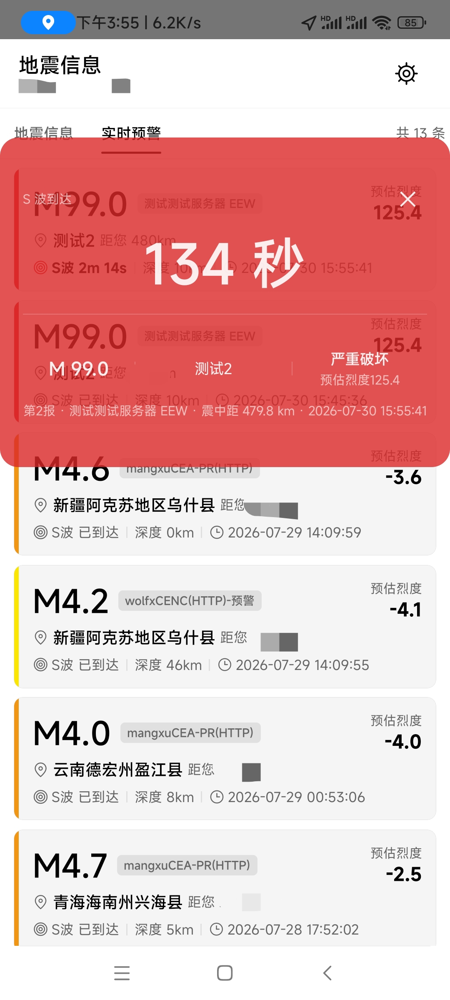
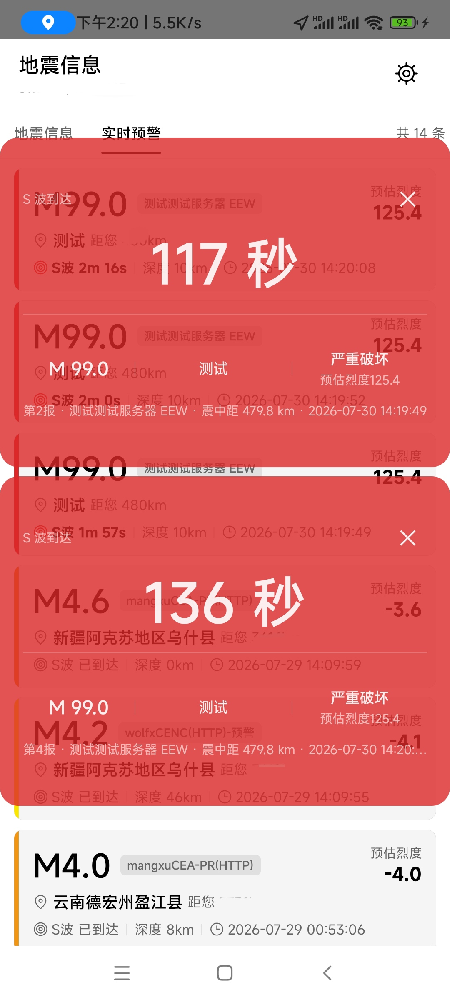
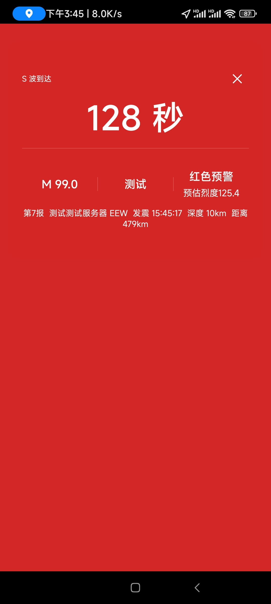
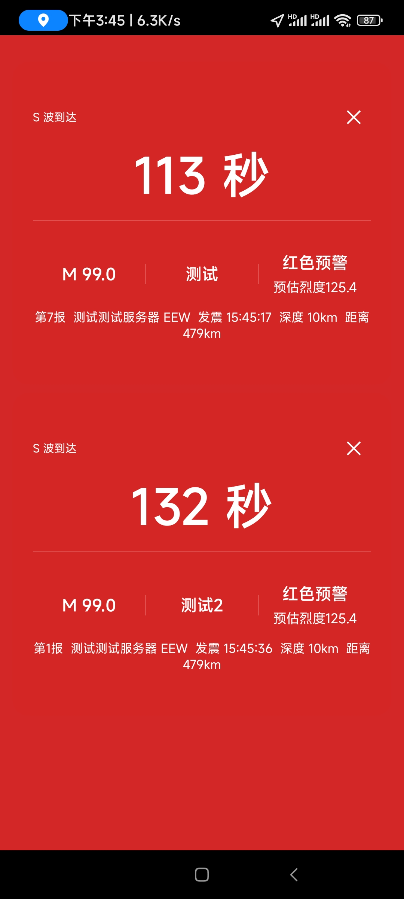

# 悬浮窗预警联动

## 概述

悬浮窗在 EEW（地震预警）事件达到 `blue` 及以上级别（预估烈度 ≥ 1）时自动显示，实时展示倒计时、震级、震中位置、震中距、发震时刻、级别提示。悬浮窗通过 Android `WindowManager + TYPE_APPLICATION_OVERLAY` 实现，填满屏幕宽度，带关闭按钮。

支持**多事件并发显示**（最多 3 个事件上下垂直排列）：大震独占显示直到倒计时归零 30 秒后，同级别地震垂直并列。前台悬浮窗、后台悬浮窗、锁屏预警 Activity 三条路径全部支持多事件并发显示。详见 [多事件并发显示规则](#多事件并发显示规则)。

预警级别按 DB/T 113.1-2026 标准按预估地震烈度分档：`silent / blue / yellow / orange / red`。

悬浮窗支持三种触发路径：
- **前台触发**（App 在前台）：由 JS 层 `useFloatingWindow` Hook 处理，与声音/震动/闪光灯联动
- **后台悬浮窗触发**（App 在后台、屏幕未锁屏）：由原生层 `EewBackgroundService` 调用 `FloatingWindowModule.showFromBackground()` 显示悬浮窗，原生层维护 tick 更新倒计时
- **锁屏触发**（App 在后台、屏幕已锁屏）：由原生层 `EewBackgroundService` 启动 `LockScreenAlertActivity` 显示，Activity 内部通过 `ReactContextProvider` 获取原生模块实例联动声音/震动/闪光灯，不依赖 JS 线程

**路径选择逻辑**（`EewBackgroundService.tryTriggerFloatingWindow`）：
- `isScreenLocked() == true` → `LockScreenAlertActivity`（setShowWhenLocked，可点亮屏幕）
- `isScreenLocked() == false` → `FloatingWindowModule`（TYPE_APPLICATION_OVERLAY，叠加在其他 App 之上）

悬浮窗/锁屏预警显示成功后同时触发：
- **声音警报**（受 `soundEnabled` 控制，循环播放直到倒计时归零后 -30 秒）
- **震动警报**（受 `vibrationEnabled` 控制，循环震动直到倒计时归零后 -30 秒）
- **闪光灯警报**（受 `flashlightEnabled` 控制，循环闪烁直到倒计时归零后 -30 秒，仅橙红级烈度 ≥ 5 触发）

> 注：前台触发路径由 JS 层 `useFloatingWindow` 联动声音/震动/闪光灯；后台悬浮窗触发路径由 `EewBackgroundService` 通过 `ReactContextProvider` 直接调用原生模块联动；锁屏触发路径由 `LockScreenAlertActivity` 通过 `ReactContextProvider` 直接调用原生模块联动（均无需经过 RN 桥，避免后台/锁屏时 JS 暂停）。

**倒计时与警报规则**：
- `remainSec > 0`：正常倒计时显示，警报持续
- `remainSec <= 0`：文字显示"地震波已到达"，**警报继续响**（不停止）
- `remainSec <= -30`：停止声音/震动/闪光灯，但 UI 保持显示，等用户手动关闭
- 取消报（`isCancel=true`）显示"地震预警取消"，3 秒后自动隐藏，且不触发声音/震动/闪光灯

用户点击✕关闭按钮后，同一事件不再自动弹出（直到新事件到来）。

## 组件架构

### 前台触发路径（App 在前台）

```
HomeScreen
  └─ useFloatingWindow({ event, alertLevel, userLocation, soundEnabled, vibrationEnabled, flashlightEnabled })
       ├─ FloatingWindowManager（原生模块）
       │    ├─ hasPermission()    检查 SYSTEM_ALERT_WINDOW 权限
       │    ├─ requestPermission() 跳转系统设置页
       │    ├─ show(content)       创建悬浮窗
       │    ├─ updateContent(c)    更新内容（每秒 tick）
       │    └─ hide()              隐藏悬浮窗
       ├─ SoundManager（声音警报）
       │    └─ playAlertSound()    循环播放 5 频率叠加警报主音
       ├─ VibratorManager（震动警报）
       │    └─ startVibrating(1000) 循环震动间隔 1000ms
       ├─ FlashlightManager（闪光灯警报）
       │    └─ startBlinking(1000)  循环闪烁间隔 1000ms（仅烈度 ≥ 5）
       └─ setInterval 每秒倒计时 tick
```

### 锁屏触发路径（App 在后台/锁屏）

```
EewBackgroundService（原生 ForegroundService）
  ├─ OkHttp WebSocket / HTTP 客户端（根据 customSource.protocol 选择）
  │    └─ 连接用户配置的 endpoint（独立于 RN JS 层，从 SharedPreferences 读取 customSources 多源配置数组）
  ├─ EewAlertEngine（原生层预警计算引擎）
  │    ├─ parseWithMapping(raw, mapping)  按 FieldMapping 解析消息（替代原 parseCencEvent）
  │    ├─ FieldMappingParser.kt           Kotlin 路径表达式解析器（与 JS 层 jsonPathExtract 一致）
  │    ├─ haversineDistance(...)   计算震中距
  │    ├─ calcCsis(...)            计算预估烈度（CEA + ICL 双模型平均）
  │    ├─ computeSWaveArrivalMs(...) 计算 S 波到达时间戳
  │    └─ computeAlertLevelByIntensity(...) 按烈度分档预警级别
  ├─ SharedPreferences（eew_alert_config）
  │    └─ 存储 alert 配置 + 用户位置（由 RN 层同步）
  ├─ ComponentCallbacks2.onTrimMemory
  │    └─ TRIM_MEMORY_UI_HIDDEN 检测 App 进入后台
  └─ startLockScreenActivity()（启动 LockScreenAlertActivity，传入 sound/vibration/flashlight 配置）
       │  多事件模式：
       │  - 首个事件：startActivity 启动 Activity（双管齐下策略适配 MIUI）
       │  - 后续事件：若 Activity 已运行（LockScreenAlertActivity.isRunning()），
       │              直接调用 instance.addEvent(eventData) 添加事件，无需重启 Activity
       │  双管齐下启动策略（适配 MIUI 等定制 ROM，仅首个事件）：
       │  1. startActivity(intent) — ForegroundService 有权启动 Activity，配合 setShowWhenLocked/setTurnScreenOn 可在锁屏显示
       │  2. Notification.fullScreenIntent — Android 10+ 同时发送高优先级通知，作为 startActivity 的增强/后备
       │     （MIUI 重装 APK 后可能拦截 fullScreenIntent，此时 startActivity 是更可靠的路径）
       └─ LockScreenAlertActivity（独立 Activity，显示在锁屏界面之上，支持多事件垂直排列）
            ├─ setShowWhenLocked(true)   API 27+ 锁屏之上显示
            ├─ setTurnScreenOn(true)     API 27+ 点亮屏幕
            ├─ requestDismissKeyguard()  请求解除键盘锁（仅无密码设备自动解除）
            ├─ WakeLock（SCREEN_BRIGHT_WAKE_LOCK + ACQUIRE_CAUSES_WAKEUP）
            ├─ events: MutableMap<eventId, LockScreenEvent>  事件列表（按级别排序，最多 3 个）
            ├─ onNewIntent(intent)        singleInstance 模式下接收新事件（备用路径，addEvent 是主路径）
            ├─ addEvent(event)            添加事件并 refreshDisplay（供 EewBackgroundService 直接调用）
            ├─ selectDisplayEvents()      选择显示事件（顶级 + 并列同级别，与悬浮窗规则一致）
            ├─ refreshDisplay()           重建事件卡片 UI（垂直排列）
            ├─ Handler 每秒 tick 更新所有事件倒计时（updateAllCountdowns）
            ├─ startAlerts()             启动声音/震动/闪光灯警报（合并一个，通过 ReactContextProvider）
            │    ├─ SoundModule.playAlertSound()        循环播放警报主音
            │    ├─ VibratorModule.startVibratingCycle(2000, 1000)  循环震动（振2s+默1s）
            │    └─ FlashlightModule.startBlinking(1000) 循环闪烁（仅最高级别事件烈度 ≥ 5）
            ├─ stopAlerts()              停止声音/震动/闪光灯（所有事件到达后 -30 秒或 onDestroy 时）
            └─ ✕ 按钮 → 移除该事件卡片（其他事件继续显示，所有事件关闭后 finish()）
```

**fullScreenIntent 通知渠道**（独立于保活通知）：
- 渠道 ID：`eew_full_screen_alert`，IMPORTANCE_HIGH，绕过勿扰
- 通知 ID：`FULL_SCREEN_INTENT_NOTIF_ID = 2`（与保活通知 ID=1 区分，避免互相覆盖）
- 由 `ensureFullScreenIntentChannel()` 在发送前创建（幂等）
- 通知构建：`setFullScreenIntent(pendingIntent, true)` + `setCategory(CATEGORY_ALARM)` + `setPriority(PRIORITY_HIGH)`

**为什么用 Activity 而不是 WindowManager 悬浮窗？**

`TYPE_APPLICATION_OVERLAY` 悬浮窗配合 `FLAG_SHOW_WHEN_LOCKED` 在 MIUI/Flye 等定制 ROM 上无法可靠显示在锁屏界面之上。改用配置了 `setShowWhenLocked(true)` 的透明 Activity 能更可靠地显示在锁屏界面之上。

**MIUI 锁屏预警权限要求（关键）**

MIUI 在锁屏状态下会默认拒绝后台 App 启动 Activity，即使 Manifest 声明了 `showWhenLocked`、有 `SYSTEM_ALERT_WINDOW` 权限、使用 `fullScreenIntent` 也不行。系统日志会输出：
```
MIUILOG- Permission Denied Activity KeyguardLocked: Intent { ... LockScreenAlertActivity ... }
Abort background activity starts from <uid>
MIUILOG- Permission Denied Activity : PendingIntent{...}  ← fullScreenIntent 同样被拒绝
```

**必须手动开启的 MIUI 权限**（设置 → 应用设置 → 应用管理 → 本 App → 权限管理）：
1. **后台弹出界面** → 允许（最关键，否则锁屏时 `startActivity` 被 abort）
2. **锁屏显示** → 允许（否则锁屏时 Activity 无法显示在锁屏之上）
3. **显示悬浮窗** → 允许（非锁屏后台悬浮窗需要，应已开启）

> 注意：`EewBackgroundService.startLockScreenActivity()` 调用 `startActivity()` 后立即返回 true 并日志输出"成功"，但 MIUI 实际可能已 abort 启动。日志的"成功"仅表示调用未抛异常，不代表 Activity 真正启动。需通过 `LockScreenAlertActivity.onCreate` 的日志确认实际启动结果。

**快速跳转应用详情页（ADB）**：
```bash
adb shell am start -a android.settings.APPLICATION_DETAILS_SETTINGS -d package:com.mdoeeewapp.android.cn
```

**透明度修复**：Activity 虽使用 `Theme.Translucent.NoTitleBar` 透明主题，但根布局 `outer` 设置不透明烈度色背景（MATCH_PARENT 填满屏幕），完全遮挡锁屏壁纸，避免锁屏壁纸色与烈度色叠加变色。内层 `container` 透明背景，内容直接显示在 `outer` 的烈度色背景上。

**文字颜色**：锁屏页面背景均为暗色（深蓝 `#1E3A8A` / 暗黄 `#713F12` / 暗橙 `#7C2D12` / 深红 `#7F1D1D`），所有文字（主文字 + 标签文字）统一使用白色 `#FFFFFF` 保证可读性，不随烈度分档切换。分隔线颜色仍按烈度分档（`intensityToDividerColor()`）。

**Manifest 配置**：
```xml
<activity
    android:name=".floatingwindow.LockScreenAlertActivity"
    android:showWhenLocked="true"
    android:turnScreenOn="true"
    android:excludeFromRecents="true"
    android:taskAffinity=""
    android:launchMode="singleInstance"
    android:exported="false"
    android:theme="@android:style/Theme.Translucent.NoTitleBar" />
```

**配置同步链路**：
```
HomeScreen (useEffect)
  ├─ BackgroundServiceManager.updateConfig(alertConfig)     → BackgroundServiceModule.updateConfig() → SharedPreferences
  ├─ BackgroundServiceManager.updateLocation(location)      → BackgroundServiceModule.updateLocation() → SharedPreferences
  ├─ BackgroundServiceManager.updateCustomSources(sources)  → BackgroundServiceModule.updateCustomSourcesJson() → SharedPreferences → reloadCustomSources()
  ├─ BackgroundServiceManager.updateAllowHttp(allowHttp)     → BackgroundServiceModule.updateAllowHttp() → SharedPreferences → reloadCustomSources()
  └─ AppState 'active' → BackgroundServiceManager.notifyAppInForeground() → EewBackgroundService.appInForeground = true + 更新 lastForegroundHeartbeatMs 心跳时间戳
```

> customSource 同步（多源并行）：从 `config.sources` 中筛选所有 `enabled && type === 'customSource' && category === 'eew'` 的源（按 priority 升序），JSON 数组字符串写入 SharedPreferences 的 `customSources` key；原生层 `reloadCustomSources()` 停止所有旧连接后为每个源按 `protocol` 启动独立的 WS 或 HTTP 连接。

> allowHttp 同步：`config.allowHttp` 变化时通过 `BackgroundServiceManager.updateAllowHttp()` 同步到原生层 SharedPreferences，并触发 `reloadCustomSources()` 重连所有源（开关关闭时非 localhost 的 HTTP 源会被拒绝连接）。

**触发条件**（必须全部满足，在 `EewBackgroundService.tryTriggerFloatingWindow()` 中检查）：
1. `alert.lockScreenEnabled == true`
2. `alert.floatingWindowEnabled == true`
3. 事件震级 `>= alert.minMagnitude`
4. 计算预估烈度 `>= alert.lockScreenIntensity`
5. 预警级别 `!= silent`
6. S 波尚未到达（`remainSec > 0`）
7. App 不在前台（`appInForeground == false`，避免与 JS 层重复触发）
8. 非取消报（`isCancel == false`）

## useFloatingWindow Hook 状态机

```
[空闲] ──event 非空且 alertLevel >= blue──> [检查权限]
[空闲] ──event.isCancel=true──> [取消报分支] ──> [显示"地震预警取消" + 3s 后 hide]
[检查权限] ──granted=true──> [show()] ──成功──> [可见 + 启动 tick + 触发声音/震动/闪光灯]
[检查权限] ──granted=false──> [隐藏]
[可见 + tick 运行] ──event 更新──> [updateContent（不重启 tick，不重复触发声音/震动/闪光灯）]
[可见 + tick 运行] ──倒计时归零──> [显示"地震波已到达" + 停止声音/震动/闪光灯（不自动关闭）]
[可见 + tick 运行] ──用户点击✕──> [hide + 停止声音/震动/闪光灯 + 标记事件已关闭]
[可见 + tick 运行] ──event 变空/级别降级──> [hide + 停止声音/震动/闪光灯]
[可见 + tick 运行] ──组件卸载──> [hide + clearTick + 停止声音/震动/闪光灯]
[已关闭事件] ──同事件 event 更新──> [跳过自动弹出（userDismissedRef === event.id）]
[已关闭事件] ──新事件到来（id 变化）──> [重置 userDismissedRef + 正常显示]
```

## 倒计时 tick 稳定性设计

### 核心原则

**tick 一旦启动就稳定运行，event 更新不会重启 tick。**

### 三层稳定性保障

#### 1. buildContentRef 解决闭包过期

`buildContent` 是 `useCallback` 依赖 `event`，event 变化时重建。但 `setInterval` 闭包捕获的 buildContent 是启动时的旧版本。

**解决**：引入 `buildContentRef`，通过 effect 同步最新 buildContent，interval 内部通过 `buildContentRef.current()` 调用最新版本。

```typescript
const buildContentRef = useRef(buildContent);
useEffect(() => {
  buildContentRef.current = buildContent;
}, [buildContent]);

const startCountdownTick = useCallback(() => {
  intervalRef.current = setInterval(() => {
    const c = buildContentRef.current?.();  // 总是调用最新版本
    if (c) FloatingWindowManager.updateContent(c).catch(() => {});
  }, COUNTDOWN_INTERVAL_MS);
}, [clearTick, computeCountdown, hideFloatingWindow]);
```

#### 2. isVisibleRef=true 时不递增 requestId

**问题**：原版 `showFloatingWindow` 每次调用都 `++requestIdRef.current`，导致正在运行的 tick 校验 `requestId !== requestIdRef.current` 失败而自杀。

**解决**：当 `isVisibleRef.current === true` 时，提前 return，只更新 arrivalRef/intensityRef/distanceRef 并调用 updateContent，不递增 requestId、不重启 tick、不重复触发声音/闪光灯。

```typescript
const showFloatingWindow = useCallback(() => {
  if (!event || !userLocation) return;

  // 已可见：仅更新内容，不重启 tick，不重复触发声音/闪光灯
  if (isVisibleRef.current) {
    arrivalRef.current = computeSWaveArrival(event, userLocation.lat, userLocation.lng);
    const dist = haversineDistance(event.lat, event.lng, userLocation.lat, userLocation.lng);
    intensityRef.current = calcCsis(event.magnitude, event.depth, dist);
    distanceRef.current = dist;
    const content = buildContent();
    if (content) FloatingWindowManager.updateContent(content).catch(() => {});
    return;  // 提前返回
  }

  // 不可见：检查权限 → show → 启动 tick（仅在此分支递增 requestId）
  const currentRequestId = ++requestIdRef.current;
  // ...
}, [event, userLocation, buildContent, hideFloatingWindow, startCountdownTick, triggerSound, triggerFlashlight]);
```

#### 3. useEffect cleanup 不清除 tick

**问题**：原版 useEffect cleanup 每次依赖变化（event 更新）都 `clearTick()`，导致 tick 频繁被清除又重启，高频事件推送下 tick 永远无法稳定。

**解决**：从 useEffect cleanup 移除 `clearTick()`，只在以下场景清除：
- `hideFloatingWindow()` 内部（事件归零/级别降级/倒计时归零延迟后/取消报延迟后）
- 组件卸载 effect

```typescript
useEffect(() => {
  if (shouldShow) {
    showFloatingWindow();
  } else {
    hideFloatingWindow();
  }
  // 不在此 cleanup 中 clearTick
}, [event, alertLevel, showFloatingWindow, hideFloatingWindow]);
```

### tick 内部校验与归零处理

```typescript
intervalRef.current = setInterval(() => {
  // 校验：组件已卸载或悬浮窗已隐藏，停止 tick
  if (!mountedRef.current || !isVisibleRef.current) {
    clearTick();
    return;
  }
  const remain = computeCountdown();
  if (remain <= 0) {
    // 倒计时归零：显示"地震波已到达"，5 秒后隐藏
    if (arrivedHideTimeoutRef.current === null) {
      const c = buildContentRef.current?.();
      if (c) FloatingWindowManager.updateContent(c).catch(() => {});
      arrivedHideTimeoutRef.current = setTimeout(() => {
        hideFloatingWindow();
      }, ARRIVED_HIDE_DELAY_MS);  // 5000ms
    }
    return;
  }
  const c = buildContentRef.current?.();
  if (c) FloatingWindowManager.updateContent(c).catch(() => {});
}, COUNTDOWN_INTERVAL_MS);
```

校验项：
- `mountedRef.current`：组件已卸载则停止
- `isVisibleRef.current`：悬浮窗已隐藏则停止
- `remain <= 0`：倒计时归零则显示"地震波已到达"并启动 5 秒延迟隐藏定时器

## 声音与闪光灯警报触发

### 触发时机

仅在**首次显示成功**（`show().then()` 内）触发，已可见时更新内容不重复触发。

```typescript
FloatingWindowManager.show(content)
  .then(() => {
    isVisibleRef.current = true;
    startCountdownTick();
    triggerSound();      // 声音警报
    triggerFlashlight(); // 闪光灯警报
  })
  .catch(() => { ... });
```

### triggerSound 逻辑

```typescript
const triggerSound = useCallback(() => {
  if (!soundEnabled) return;  // 配置关闭则跳过
  SoundManager.playAlertSound().catch(() => {});
}, [soundEnabled]);
```

### triggerFlashlight 逻辑

```typescript
const triggerFlashlight = useCallback(() => {
  if (!flashlightEnabled) return;  // 配置关闭则跳过
  if (intensityRef.current < FLASHLIGHT_INTENSITY_THRESHOLD) return;  // 烈度 < 5 跳过
  // 循环闪烁，直到 hideFloatingWindow 调用 stopBlinking
  FlashlightManager.startBlinking(FLASHLIGHT_BLINK_INTERVAL_MS).catch(() => {});
}, [flashlightEnabled]);
```

### 隐藏时停止声音/闪光灯

`hideFloatingWindow()` 和组件卸载 effect 中会调用 `SoundManager.stopAlertSound()` 和 `FlashlightManager.stopBlinking()` 停止循环播放/闪烁。

详见 [sound-flash-alert.md](./sound-flash-alert.md)。

## 自动调节媒体音量

### 设计动机

为确保用户在任何媒体音量下都能听到地震预警警报声，`SoundModule` 新增了自动调节媒体音量能力。当用户启用此功能后，App 会在播放警报前临时将媒体音量提升到设定值，警报结束后再恢复原始音量。

### 实现要点

- **音频通道切换**：`SoundModule` 改用 `USAGE_MEDIA`（媒体通道）替代原 `USAGE_ALARM`（闹钟通道），使音量调节作用于媒体音量流
- **播放前提升音量**：当 `autoVolumeEnabled=true` 时，`playAlertSound()` 先保存当前媒体音量，再将媒体音量设置为 `alertVolume%`（相对于最大媒体音量的百分比），然后开始播放警报主音
- **结束后恢复音量**：`stopAlertSound()` 停止播放后将媒体音量恢复为播放前保存的原始值
- **三路径统一生效**：自动调节音量在前台悬浮窗、后台悬浮窗、锁屏预警三条触发路径下均生效（均通过 `SoundModule` 播放/停止）

### 工作流程

```
playAlertSound()
  ├─ autoVolumeEnabled == true?
  │    ├─ 保存当前媒体音量 originalVolume
  │    └─ 设置媒体音量 = maxVolume * alertVolume / 100
  └─ 循环播放警报主音（USAGE_MEDIA 通道）

stopAlertSound()
  ├─ 停止播放警报主音
  └─ autoVolumeEnabled == true && originalVolume 已保存?
       └─ 恢复媒体音量为 originalVolume
```

### 配置入口

设置 → 报警方式 → 自动调节音量

- **开关**：启用/禁用自动调节音量功能（`autoVolumeEnabled`）
- **音量滑块**：调节目标音量百分比，范围 0–100%（`alertVolume`）

## 关闭按钮联动停止

关闭悬浮窗时必须同步停止所有警报（声音/震动/闪光灯），三种触发路径各有独立的关闭联动机制：

### 前台触发路径（JS 层联动）

用户点击悬浮窗 ✕ 关闭按钮时，原生层通过 `DeviceEventEmitter` 发送 `onClosed` 事件通知 JS 层。`useFloatingWindow` 监听该事件并：

1. 记录被关闭的事件 id（`userDismissedRef = event.id`），同一事件不再自动弹出
2. 调用 `hideFloatingWindow()` 停止声音/震动/闪光灯循环并清理状态

```typescript
useEffect(() => {
  const subscription = DeviceEventEmitter.addListener('onClosed', () => {
    log('FLOAT', '收到原生层关闭事件', {});
    if (event) {
      userDismissedRef.current = event.id;
      log('FLOAT', '标记事件为用户已关闭', {eventId: event.id});
    }
    hideFloatingWindow();
  });
  return () => { subscription.remove(); };
}, [hideFloatingWindow, event]);
```

### 后台悬浮窗触发路径（原生层 onClosedCallback 联动）

App 在后台时 JS 线程可能被挂起，`onClosed` 事件无法可靠传递到 JS 层。因此 `EewBackgroundService` 在调用 `showFromBackground()` 前设置 `FloatingWindowModule.onClosedCallback`，用户点击✕关闭时由原生层直接停止警报和 tick：

```kotlin
// EewBackgroundService.showFloatingWindowFromBackground()
module.onClosedCallback = {
  Log.i(TAG, "用户关闭后台悬浮窗，停止警报和 tick")
  stopBackgroundFloatingWindowTick()  // 停止倒计时 tick
  stopAlertsFromBackground()          // 停止声音/震动/闪光灯
}
module.showFromBackground(content)
```

`FloatingWindowModule` 关闭按钮点击时同时触发两条通知路径：
```kotlin
setOnClickListener {
  emitClosed()                  // 通知 JS 层（前台时有效）
  onClosedCallback?.invoke()    // 通知原生层（后台时有效）
  removeFloatingView()
}
```

### 锁屏触发路径（Activity onDestroy 联动）

`LockScreenAlertActivity` 的✕按钮调用 `finish()`，触发 `onDestroy()` 停止 tick 和警报（详见锁屏预警章节）。

**设计要点**：
- `onClosed` 事件仅由 close 按钮点击触发（`emitClosed()`）
- `hide()` 方法不发 `onClosed` 事件，避免 JS 主动调用 `hideFloatingWindow()` 时产生循环
- 前台场景：收到 `onClosed` 事件后调用 `hideFloatingWindow()`，内部停止声音/震动/闪光灯、清理 tick、重置 `isVisibleRef`
- 后台场景：`onClosedCallback` 直接调用 `stopAlertsFromBackground()` 停止原生层警报，不依赖 JS 桥
- `userDismissedRef` 记录被关闭的事件 id，`showFloatingWindow` 入口检查同一事件不再自动弹出
- 新事件到来（`event.id` 变化）时重置 `userDismissedRef`，允许重新弹出

## 倒计时归零（已到达）行为

倒计时归零时显示"地震波已到达"，**不自动关闭**，保持显示直到用户手动点✕关闭。此时停止声音/震动/闪光灯（警报结束），但悬浮窗保持可见以便用户查看震级、位置等信息。

```typescript
if (remain <= 0) {
  if (!arrivedRef.current) {
    arrivedRef.current = true;
    // 更新内容显示"地震波已到达"
    // 停止声音/震动/闪光灯
    SoundManager.stopAlertSound();
    VibratorManager.stopVibrating();
    FlashlightManager.stopBlinking();
  }
  return;  // 不自动隐藏
}
```

## 多事件并发显示规则

当同时收到多个不同地震的预警时，悬浮窗按以下规则显示（用户决策）。

### 核心规则

1. **候选过滤**：未被用户手动关闭 + `remain > -30`（倒计时归零后 30 秒内仍算活跃）；取消报（`isCancel=true`）不受此限制
2. **排序**：按预警级别降序（red > orange > yellow > blue），同级别按预估烈度降序
3. **顶级事件**：候选中级别最高的那一个，显示在最上方
4. **并列事件**：与顶级**同级别**（差 0 档）的其他事件，最多 2 个，显示在下方
5. **大小压制**：差 ≥ 1 档的事件被顶级"压制"不显示，等顶级 `remain <= -30` 后才让下一级显示
6. **手动关闭**：用户点✕关闭顶级事件后，顶级被过滤，下一级事件**立即**显示

### 场景示例

**场景 1：大震 + 小震（级别差 ≥ 1 档）**

| 时刻 | 大震 remain | 小震 remain | 显示 |
|------|------------|------------|------|
| 倒计时中 | 30s | 20s | 仅大震 |
| 大震归零 | -5s | 15s | 仅大震（显示"地震波已到达"） |
| 大震归零后 29s | -29s | 1s | 仅大震（仍独占显示） |
| 大震归零后 30s | -30s | 0s | 大震被过滤，显示小震（如果还有倒计时） |
| 大震归零后 31s | -31s | -1s | 小震也被过滤，无显示 |

**场景 2：差不多大的地震（同级别）**

两个 red 级别地震同时预警 → 上下垂直排列两个悬浮窗（顶级在上，并列在下）。

**场景 3：用户手动关闭顶级**

大震(red) + 小震(blue) 同时预警，用户点✕关闭大震 → 大震标记 `userDismissed`，小震**立即**显示。

### 关键参数

| 参数 | 值 | 说明 |
|------|-----|------|
| `PEER_LEVEL_MAX_DIFF` | 0 | 并列事件与顶级最大级别差（0 = 同级别才算并列） |
| `MAX_DISPLAY_EVENTS` | 3 | 最大同时显示悬浮窗数（1 顶级 + 2 并列） |
| `ALERT_CONTINUE_AFTER_ARRIVAL_SEC` | -30 | 倒计时归零后继续显示/警报的秒数阈值 |

### 实现位置

| 层 | 文件 | 函数 |
|----|------|------|
| 前台（JS） | `src/hooks/useFloatingWindow.ts` | `selectDisplayEvents()` |
| 后台（原生） | `EewBackgroundService.kt` | `selectBackgroundDisplayEvents()` |
| 锁屏（原生） | `LockScreenAlertActivity.kt` | `selectDisplayEvents()` |

三层逻辑完全一致，确保前台/后台/锁屏切换时显示行为统一。

### 同 ID 预警报告处理

同一事件 ID 的多次报告（震级可能随测算更新）**不直接覆盖**，保留震级较高的那个（在 `useEewStream.mergeEvent` 中实现）：

```typescript
const idxById = prev.findIndex(e => e.id === event.id);
if (idxById >= 0) {
  const old = prev[idxById];
  if (event.magnitude > old.magnitude) {
    const updated = [...prev];
    updated[idxById] = event;
    return updated;
  }
  return prev;  // 新报告震级 ≤ 旧报告，保留旧报告
}
```

## 取消报处理

当数据源推送 `isCancel=true` 的事件时（JMA 数据源支持），悬浮窗走单独分支：

1. **不检查倒计时**：即使 S 波已到达也显示
2. **不触发声音/闪光灯**：取消报是解除警报，不应惊吓用户
3. **显示"地震预警取消"**：由原生层 `formatCountdown` 根据 `isCancel=true` 映射
4. **3 秒后自动隐藏**：`CANCEL_HIDE_DELAY_MS = 3000`

```typescript
if (event.isCancel === true) {
  FloatingWindowManager.hasPermission()
    .then(granted => {
      // ... 权限检查 ...
      FloatingWindowManager.show(content)
        .then(() => {
          isVisibleRef.current = true;
          cancelHideTimeoutRef.current = setTimeout(() => {
            hideFloatingWindow();
          }, CANCEL_HIDE_DELAY_MS);  // 3000ms
        });
    });
  return;  // 不走普通报分支
}
```

## 远程日志调试

### 启用步骤

1. **启动日志服务器**（开发机）：
   ```bash
   yarn log-server
   ```
   监听 `0.0.0.0:8089`

2. **配置手机端连接**（二选一）：

   **方式 A：adb reverse 端口映射（推荐，绕过防火墙）**
   ```bash
   adb reverse tcp:8089 tcp:8089
   ```
   手机端服务器地址填：`ws://127.0.0.1:8089`
   - 优点：通过 USB 隧道转发，不受 Windows 防火墙（Public profile）拦截
   - 缺点：需要 USB 连接

   **方式 B：局域网直连**
   - 手机端服务器地址填：`ws://<开发机局域网IP>:8089`
   - 注意：需确保 Windows 防火墙允许 8089 端口入站（Private profile）
   - 若连接卡在「连接中」，多为防火墙拦截，改用方式 A

3. **App 端启用远程日志**：
   - 设置页 → 调试设置
   - 打开「远程日志」开关
   - 填入服务器地址（见步骤 2）
   - 点击「测试连接」按钮验证连接

4. **观察日志**：
   log-server 控制台会输出 `[EEW:FLOAT]` 系列日志。

### FLOAT 模块日志点

| 位置 | 日志 | 说明 |
|------|------|------|
| `showFloatingWindow` 入口 | `showFloatingWindow { hasEvent, hasLocation, isVisible, isCancel }` | 每次调用入口 |
| 取消报分支 | `取消报，显示"地震预警取消"` | isCancel=true 走单独分支 |
| 取消报 show 成功 | `取消报 show 成功 { requestId }` | 取消报悬浮窗显示成功 |
| 取消报超时隐藏 | `取消报显示超时，隐藏` | 3 秒后自动隐藏 |
| 不可见分支-过期检查 | `事件已过期(S波到达)，不显示 { remain }` | S 波已到达，不显示悬浮窗 |
| `isVisibleRef=true` 分支 | `updateContent (已可见) { mag, countdown }` | 已可见时更新内容 |
| `hasPermission` 返回 | `hasPermission { granted }` | 权限检查结果 |
| `show().then` | `show 成功，启动 tick { requestId }` | 悬浮窗显示成功 |
| `show().catch` | `show 失败` | 悬浮窗显示失败 |
| `startCountdownTick` 启动 | `tick 启动` | tick 首次启动 |
| tick 内部每次更新 | `tick { remain }` | 每秒一条，remain 递减 |
| `triggerSound` | `触发声音警报` | 声音警报触发 |
| `triggerSound` 禁用 | `声音警报已禁用，跳过` | soundEnabled=false |
| `triggerVibration` | `触发震动警报(循环) { intervalMs }` | 震动警报触发 |
| `triggerVibration` 禁用 | `震动警报已禁用，跳过` | vibrationEnabled=false |
| `triggerFlashlight` | `触发闪光灯警报(循环) { intensity, intervalMs }` | 闪光灯触发 |
| `triggerFlashlight` 禁用 | `闪光灯警报已禁用，跳过` | flashlightEnabled=false |
| `triggerFlashlight` 未达阈值 | `烈度未达闪光灯触发阈值，跳过 { intensity, threshold }` | 烈度 < 5 |
| `hideFloatingWindow` | `hide { wasVisible }` | 隐藏悬浮窗 |
| `onClosed` 事件监听 | `收到原生层关闭事件` | 用户点击悬浮窗关闭按钮，原生层通知 JS 层 |
| `onClosed` 标记事件 | `标记事件为用户已关闭 { eventId }` | 记录被关闭事件 id，防止自动重新弹出 |
| 用户已关闭事件 | `用户已关闭此事件，跳过自动弹出 { eventId }` | 同一事件不再自动弹出 |
| 新事件重置标记 | `新事件到来，重置用户关闭标记 { oldId, newId }` | 新事件允许重新弹出 |
| 倒计时归零 | `倒计时归零，显示"地震波已到达"（不自动关闭）` | 倒计时结束，停止警报但不隐藏 |

### 验证 tick 稳定性

正常情况下，事件推送期间应看到：
```
[EEW:FLOAT] showFloatingWindow { isVisible: false, isCancel: false }
[EEW:FLOAT] hasPermission { granted: true }
[EEW:FLOAT] show 成功，启动 tick { requestId: 1 }
[EEW:FLOAT] tick 启动
[EEW:FLOAT] 触发声音警报
[EEW:FLOAT] 触发震动警报(循环) { intervalMs: 1000 }
[EEW:FLOAT] 触发闪光灯警报(循环) { intensity: 6.2, intervalMs: 1000 }
[EEW:FLOAT] tick { remain: 30 }
[EEW:FLOAT] tick { remain: 29 }
[EEW:FLOAT] updateContent (已可见) { mag: 5.2, countdown: 28 }
[EEW:FLOAT] tick { remain: 28 }
...
[EEW:FLOAT] 倒计时归零，显示"地震波已到达"（不自动关闭）
[EEW:FLOAT] 收到原生层关闭事件
[EEW:FLOAT] 标记事件为用户已关闭 { eventId: "customSource-api.example.com-EQ-001" }
[EEW:FLOAT] hide { wasVisible: true }
[EEW:FLOAT] 用户已关闭此事件，跳过自动弹出 { eventId: "customSource-api.example.com-EQ-001" }
```

**异常特征**（已修复的 bug）：
- `tick 启动` 频繁出现但 `tick { remain }` 很少 → requestId 自杀问题
- 只有 `updateContent (已可见)` 但无 `tick` → interval 被清除

## 悬浮窗 UI 约束

### 布局结构（DB/T 113.1-2026 标准）

```
┌──────────────────────────────────────────────────────┐
│  S 波到达                                      ✕     │  顶行：标签左 + 关闭按钮右
│                                                      │
│                    30 秒                              │  倒计时大字居中 48sp BOLD
│                                                      │
│  ──────────────────────────────────────────────────  │  分隔线（20% 白）
│    M 5.8    │    四川成都市    │ 严重破坏(预估烈度9.0) │  底行三段分布（细分隔竖线分隔）
│                                                      │
│  第1报 · 中国地震台网 · 震中距 128.5 km · 15:30:00     │  信息行（第N报 · 数据源 · 震中距 · 时间）
└──────────────────────────────────────────────────────┘
```

**非锁屏悬浮窗实际效果**：

**单事件**：



**多事件并发**：



- **顶行**：左侧 "S 波到达" 标签（11sp），右侧 ✕ 关闭按钮（18sp）
- **倒计时**：居中大字 48sp BOLD
  - 正常倒计时：格式为 "N 秒"（如 "30 秒"）
  - 倒计时归零：显示 "地震波已到达"
  - 取消报：显示 "地震预警取消"
- **分隔线**：水平 1dp，20% 白色（#33FFFFFF）
- **底行三段**（用细分隔竖线分隔）：
  - 震级 "M 5.8"（16sp BOLD，居中）
  - 位置（13sp，居中，长文本省略）
  - 级别提示 + 预估烈度（12sp，居中，长文本省略），格式如"严重破坏(预估烈度9.0)"
- **信息行**：格式为"第N报 · 数据源名称 · 震中距 X km · 时间"（11sp，居中，长文本省略）。其中"第N报"和"数据源名称"仅在数据源提供时显示（"第N报"由 `fieldMapping.reportNum` 配置，"数据源名称"由 `SourceConfig.name` 自动填充），未提供时只显示"震中距 X km · 时间"

### 级别提示文字映射

级别提示文字后附上预估烈度数值，格式为"提示文字(预估烈度X.X)"，如"严重破坏(预估烈度9.0)"。烈度整数时不显示小数（如"严重破坏(预估烈度8)"）。

| AlertLevel | 提示文字 | 烈度范围 | 显示示例 |
|------------|----------|----------|----------|
| red | 严重破坏 | ≥ 7 | 严重破坏(预估烈度9.0) |
| orange | 破坏 | ≥ 5 | 破坏(预估烈度6.5) |
| yellow | 强烈有感 | ≥ 3 | 强烈有感(预估烈度4.0) |
| blue | 有感 | ≥ 1 | 有感(预估烈度2) |
| silent | （空） | < 1 | （空） |

### 背景色分档（DB/T 113.1-2026 标准）

按预估地震烈度分档，带 80% 不透明度（#CC 前缀）。文字颜色按背景亮度动态切换：黄色背景（烈度 3~5）配黑字，其他背景配白字。

| 烈度范围 | 预警级别 | 背景色 | RGB 值 | 文字颜色 |
|----------|----------|--------|--------|----------|
| ≥ 7 | red（红） | #CCDC2828 | RGB(220, 40, 40) | 白字 #E6FFFFFF |
| ≥ 5 且 < 7 | orange（橙） | #CCF09614 | RGB(240, 150, 20) | 白字 #E6FFFFFF |
| ≥ 3 且 < 5 | yellow（黄） | #CCFAE600 | RGB(250, 230, 0) | **黑字 #E6000000** |
| ≥ 1 且 < 3 | blue（蓝） | #CC3764FF | RGB(55, 100, 255) | 白字 #E6FFFFFF |
| < 1 | silent | #CC000000 | 默认黑色 | 白字 #E6FFFFFF |

**文字颜色分档方法**：
- `intensityToTextColor(content)`：主文字（倒计时/震级/位置/级别），黄色背景返回 90% 不透明黑，其他返回 90% 不透明白
- `intensityToLabelColor(content)`：标签文字（"S 波到达"/信息行），黄色背景返回 60% 不透明黑，其他返回 60% 不透明白
- `intensityToDividerColor(content)`：分隔线，黄色背景返回 20% 不透明黑，其他返回 20% 不透明白

### 样式约束

- 填满屏幕宽度（MATCH_PARENT），顶部固定（y=120dp）
- 圆角 16dp
- 高度再加 50%（相对原始布局）：
  - 容器上下内边距：42dp（原 28dp）
  - 倒计时上下内边距：12dp（原 8dp）
  - 底行顶部间距：30dp（原 20dp）
- 不可拖动（固定显示）
- 关闭按钮在右上角，点击隐藏

## 历史问题与修复记录

### P1-12/13/20 竞态处理（初版）

- 引入自增 requestId，每次 showFloatingWindow 调用前递增
- .then 回调中校验 requestId 是否为最新
- mountedRef 守卫组件卸载后的 setState
- interval 启动移入 show().then() 内

### 删除全屏报警页面（FullScreenAlertActivity）

**背景**：原架构在后台触发预警时会弹出全屏报警页面（FullScreenAlertActivity），与悬浮窗功能重叠，用户体验不佳。

**删除内容**（7 个文件）：
- `FullScreenAlertActivity.kt` / `FullScreenAlertController.kt` / `FullScreenAlertModule.kt` / `FullScreenAlertPackage.kt`（Kotlin 原生层）
- `src/native/FullScreenAlert.ts`（JS 接口）
- `src/hooks/useLockScreenAlert.ts`（锁屏报警 Hook）
- `docs/lock-screen-alert.md`（文档）

**引用清理**（4 个文件）：
- `AndroidManifest.xml`：移除 `<activity>` 声明
- `MainApplication.kt`：移除 `FullScreenAlertPackage` 注册
- `HomeScreen.tsx`：移除 `useLockScreenAlert` 调用
- `permissionItems.ts`：更新注释移除「锁屏报警」提及

**结果**：预警仅通过悬浮窗展示，不再弹出全屏页面。

### 修复：悬浮窗不刷新（倒计时永远不减少）

**根因**（三层叠加）：
1. `isVisibleRef=true` 时仍递增 requestId 并重启 tick → 旧 tick 校验失败自杀
2. useEffect cleanup 每次依赖变化都 clearTick → tick 频繁被清除
3. interval 闭包捕获过期的 buildContent → 即使 tick 能跑，内容也不更新

**修复**：
1. 引入 `buildContentRef`，interval 通过 ref 调用最新 buildContent
2. `startCountdownTick` 移除 requestId 参数，改用 isVisibleRef/mountedRef 校验
3. `showFloatingWindow` 在 `isVisibleRef=true` 时提前 return，不递增 requestId、不重启 tick
4. useEffect cleanup 移除 clearTick，只在 hideFloatingWindow 和组件卸载时清除

### 修复：弹出-关闭循环（S 波已到达的事件反复触发 show/hide）

**根因**：
当 S 波已到达（`arrival < now`）的事件被反复推送时：
1. event 推送（新引用）→ `showFloatingWindow` useCallback 重建 → useEffect 重新触发
2. `isVisibleRef.current === false` → 走"不可见"分支 → `show()` → `isVisibleRef=true` → `startCountdownTick()`
3. tick 第一秒：`computeCountdown() = 0` → `hideFloatingWindow()` → `isVisibleRef=false`, `clearTick()`
4. 下一次 event 推送（1 秒后）→ 回到步骤 1
5. 形成「弹出→1秒后关闭→弹出→1秒后关闭」循环

**修复**：
在 `showFloatingWindow` 的"不可见"分支开头，提前计算 arrival/intensity，检查 `remain <= 0` 则直接 return 不显示。S 波已到达的事件对用户已无预警意义，不应再触发悬浮窗。

### DB/T 113.1-2026 标准改造

**背景**：原系统按震级分档（5 级：silent/info/advisory/warning/critical），不符合 DB/T 113.1-2026 地震行业标准要求按预估地震烈度分档。

**改动**：
- AlertLevel 类型从 `silent/info/advisory/warning/critical` 改为 `silent/blue/yellow/orange/red`
- 新增 `computeAlertLevelByIntensity(intensity)` 按烈度分档（≥7红/≥5橙/≥3黄/≥1蓝）
- 颜色标准化：红 RGB(220,40,40) / 橙 RGB(240,150,20) / 黄 RGB(250,230,0) / 蓝 RGB(55,100,255)
- 悬浮窗背景色按烈度分档着色（80% 不透明度）
- 级别提示文字标准化：严重破坏/破坏/强烈有感/有感
- 新增震中距、发震时刻信息行
- 倒计时归零显示"地震波已到达"
- 取消报显示"地震预警取消"并保留接口
- 新增声音警报（AudioTrack 合成 5 频率同时叠加，循环播放直到悬浮窗隐藏）
- 新增闪光灯警报（Camera2 torch，循环闪烁直到悬浮窗隐藏，仅橙红级触发）
- 黄色背景（烈度 3~5）下文字改用黑色，解决对比度不足问题

### 修复：MIUI 锁屏预警不触发（fullScreenIntent 被拦截 + 后台 Activity 启动限制）

**根因**（多重叠加）：
1. MIUI 后台 Activity 启动拦截：`startActivity()` 从后台启动 Activity 时被 MIUI 拦截，提示 `Permission Denial: Activity KeyguardLocked`
2. MIUI 自定义权限拦截：`fullScreenIntent` 通知被 MIUI 自定义 op（10020/10021）拦截，通知被降级
3. MIUI 重装 APK 后权限重置：每次重装 APK 后 appops 权限被重置，需重新授权
4. 倒计时过短：震中距离过近时 S 波到达时间短，预警界面一闪而过无法观察

**修复**：
1. **双管齐下启动策略**：先尝试 `startActivity()` 直接启动（ForegroundService 有权启动），同时发送 `fullScreenIntent` 通知作为增强/后备
   - startActivity 成功：fullScreenIntent 作为"增强"同时发送
   - startActivity 失败：fullScreenIntent 作为"后备"接管启动
2. **新增 `USE_FULL_SCREEN_INTENT` 权限**：AndroidManifest.xml 声明，支持 `Notification.fullScreenIntent`
3. **独立高优先级通知渠道**：`eew_full_screen_alert`（IMPORTANCE_HIGH，绕过勿扰），与保活通知渠道区分
4. **MIUI appops 授权**：通过 `adb shell appops set com.mdoeeewapp.android.cn 10020/10021 allow` 授权
5. **倒计时保底 30 秒**：`safeRemainSec = maxOf(remainSec, 30)`，确保测试预警界面有足够观察时间

**验证日志**（双管齐下策略生效）：
```
EewBackgroundService: 直接 startActivity 启动 LockScreenAlertActivity 成功
EewBackgroundService: fullScreenIntent 通知已发送（增强）
LockScreenAlertActivity: onCreate: mag=7.5 intensity=9.22 level=red ...
```

## 锁屏预警实现（EewBackgroundService + LockScreenAlertActivity）

### 设计动机

原架构中，锁屏预警是空壳：
- 悬浮窗缺少锁屏显示 flag（`FLAG_SHOW_WHEN_LOCKED`），锁屏时无法显示
- WebSocket 在 JS 层，锁屏后 RN JS 线程被系统挂起，无法接收事件
- 后台服务仅做保活，无预警能力

为彻底实现锁屏预警，将数据源接收与锁屏显示迁移到原生层：
- 数据源接收：`EewBackgroundService` 使用 OkHttp WebSocket/HTTP 客户端（按 customSource.protocol 选择）
- 锁屏显示：`LockScreenAlertActivity` 使用 `setShowWhenLocked(true)` 显示在锁屏界面之上

### 核心组件

#### EewBackgroundService（原生 ForegroundService）

- **数据源连接（多源并行）**：从 SharedPreferences 读取 `customSources` JSON 数组，为每个源创建独立的 `SourceConnection` 实例，按 `protocol` 启动 WebSocket 或 HTTP GET 轮询
- **WS 指数退避重连**：初始 1s，倍数 2，上限 30s（每个源独立维护重连状态）
- **HTTP 心跳超时**：`max(pollIntervalMs * 3, 10000ms)`
- **配置热更新**：`reloadCustomSources()` 停止所有旧连接 → 读新配置数组 → 为每个源启动新连接
- **事件处理**：`handleSourceData(text, config)` 按 FieldMapping 解析 → 转发 JS → 启动 LockScreenAlertActivity
- **双层去重**（修复前后台切换不触发问题）：
  - **转发去重**（`lastDedupKey` = `eventId:originTime`）：同一报告不重复转发给 JS 层
  - **触发去重**（`lastTriggeredEventId` = `eventId`）：同一事件只触发一次悬浮窗
  - 前台收到新事件时，转发给 JS 但**不触发也不标记** `lastTriggeredEventId`，切到后台后仍可触发一次
  - 后台收到新事件时，检查触发条件并触发，成功后标记 `lastTriggeredEventId`
- **前后台检测**：`ComponentCallbacks2.onTrimMemory(TRIM_MEMORY_UI_HIDDEN)` 检测 App 进入后台
- **前台心跳超时机制**（防止 JS 线程死亡后 `appInForeground` 永久为 true 导致后台预警失灵）：
  - **常量**：`FOREGROUND_HEARTBEAT_TIMEOUT_MS = 60_000L`（60 秒）
  - **心跳字段**：`lastForegroundHeartbeatMs: Long`，在 `onStartCommand()` 中初始化为当前时间，避免服务启动时误判超时
  - **心跳更新**：`notifyAppInForeground()` 被 JS 层调用时，设置 `appInForeground = true` 并更新 `lastForegroundHeartbeatMs = System.currentTimeMillis()`
  - **心跳检查**：`handleSourceData()` 收到数据后、转发给 JS 层之前，检查心跳是否过期：若 `now - lastForegroundHeartbeatMs > FOREGROUND_HEARTBEAT_TIMEOUT_MS`，则认为 JS 线程已死亡，强制将 `appInForeground` 设为 `false`，后续预警由原生层接管触发
  - **效果**：即使 JS 线程崩溃或 RN 桥断开导致心跳停止，60 秒后服务自动切回后台模式，悬浮窗/锁屏预警由原生层可靠触发，不依赖 JS 层
- **事件转发**：通过 `DeviceEventEmitter` 发送 `onEewEvent` 和 `onWsStatus` 事件给 JS 层

#### LockScreenAlertActivity（锁屏预警 Activity）

- **`setShowWhenLocked(true)`**（API 27+）：Activity 显示在锁屏界面之上
- **`setTurnScreenOn(true)`**（API 27+）：自动点亮屏幕
- **`requestDismissKeyguard()`**：请求解除键盘锁（仅无密码/已解锁设备自动解除，有密码需用户手动解锁）
- **WakeLock**：`SCREEN_BRIGHT_WAKE_LOCK | ACQUIRE_CAUSES_WAKEUP`，保持屏幕常亮直到 Activity 销毁
- **倒计时 tick**：内部 `Handler` 每秒更新倒计时显示
- **警报联动**：
  - `startAlerts()`（onCreate 调用）：通过 `ReactContextProvider` 获取 `SoundModule`/`VibratorModule`/`FlashlightModule` 实例，启动循环播放/震动/闪烁
  - `stopAlerts()`（onDestroy 或倒计时归零调用）：停止所有警报循环
  - 声音：循环播放警报主音（受 `soundEnabled` 控制，通过 `EXTRA_SOUND_ENABLED` 传入）
  - 震动：循环震动，振 2s + 默 1s（受 `vibrationEnabled` 控制，通过 `EXTRA_VIBRATION_ENABLED` 传入）
  - 闪光灯：循环闪烁，仅烈度 ≥ 5 触发（受 `flashlightEnabled` 控制，通过 `EXTRA_FLASHLIGHT_ENABLED` 传入）
- **关闭方式**：用户点击✕按钮 → `finish()`；返回键被禁用（防误触）
- **UI**：代码构建（与 FloatingWindowModule 悬浮窗样式一致），按烈度分档背景色
  - **根布局 `outer`**：MATCH_PARENT 填满屏幕，不透明烈度色背景（修复透明度叠加变色问题）
  - **内层 `container`**：透明背景，内容直接显示在 `outer` 的烈度色背景上
- **级别文字**：格式为"颜色预警(预估烈度X.X)"，在级别文字后附上预估烈度数值，如"橙色预警(预估烈度6.0)"、"红色预警(预估烈度8)"。烈度整数时不显示小数
- **信息行**：格式为"第N报  数据源名称  发震 HH:mm:ss  深度 Xkm  距离 Xkm"（报告编号 · 数据源名称 · 发震时刻 · 震源深度 · 震中距）。其中"第N报"和"数据源名称"仅在数据源提供时显示（"第N报"由 `fieldMapping.reportNum` 配置，"数据源名称"由 `SourceConfig.name` 自动填充），未提供时省略对应字段

**为什么用 Activity 而不是 WindowManager 悬浮窗？**

`TYPE_APPLICATION_OVERLAY` 悬浮窗配合 `FLAG_SHOW_WHEN_LOCKED` 在 MIUI/Flye 等定制 ROM 上无法可靠显示在锁屏界面之上（WindowManager 会创建窗口，但被锁屏界面遮挡）。改用配置了 `setShowWhenLocked(true)` 的透明 Activity 能更可靠地显示在锁屏界面之上，因为 Activity 是系统级的窗口层级。

**为什么用透明主题 + 不透明根布局？**

Activity 使用 `Theme.Translucent.NoTitleBar` 透明主题（保持灵活的系统 UI 行为），但根布局 `outer` 设置不透明烈度色背景填满整个屏幕。这样：
1. 锁屏壁纸被完全遮挡（不透过 Activity 显示）
2. 烈度色不被锁屏壁纸色叠加（避免变色）
3. 整个屏幕显示统一的烈度色，视觉上最醒目

#### EewAlertEngine（原生层预警计算引擎）

与 JS 层 `src/utils/eew.ts` 算法完全一致：
- `parseWithMapping(raw, mapping)`：按 FieldMapping 解析数据源消息（替代原 `parseCencEvent`），支持任意 JSON 格式
- `haversineDistance()`：球面距离
- `calcCsis()`：CSIS 烈度预估（CEA + ICL 双模型平均）
- `computeSWaveArrivalMs()`：S 波到达时间戳
- `computeAlertLevelByIntensity()`：按烈度分档预警级别

> `FieldMappingParser.kt` 是 JS 层 `jsonPathExtract.ts` 的 Kotlin 移植版，支持 `$.field`、`$.a.b[0].c`、`$.field?`（可选）、`$.time * 1000`（四则运算）语法。

#### BackgroundServiceModule（RN 桥接模块）

新增 customSource 多源配置同步方法：

| ReactMethod | 作用 |
|-------------|------|
| `updateCustomSourcesJson(sourcesJson: String?)` | 写入/删除 SharedPreferences 的 `customSources` key（JSON 数组），并触发 `EewBackgroundService.reloadCustomSources()` 热更新所有连接 |
| `updateAllowHttp(allowHttp: Boolean)` | 写入 SharedPreferences 的 `allowHttp` key，并触发 `EewBackgroundService.reloadCustomSources()` 热更新所有连接（开关变化后重新检查每个源的 HTTP 协议） |

JS 层通过 `BackgroundServiceManager.updateCustomSources(sources)` 调用，`sources` 为 `SourceConfig[]`（多源数组），序列化为 JSON 数组字符串后传入。
JS 层通过 `BackgroundServiceManager.updateAllowHttp(allowHttp)` 调用，`allowHttp` 为 `boolean`。

#### ReactContextProvider（全局 ReactContext 与 NativeModule 提供者）

单例对象，供 `EewBackgroundService`（非 RN 生命周期内）和 `LockScreenAlertActivity`（非 RN 生命周期内）获取原生模块实例：

| 引用 | 设置时机 | 用途 |
|------|---------|------|
| `reactApplicationContext` | `BackgroundServiceModule` 构造函数 | DeviceEventEmitter 转发事件给 JS 层 |
| `floatingWindowModule` | `FloatingWindowModule` 构造函数（invalidate 时清除） | 前台悬浮窗 show/hide（备用，锁屏预警改用 Activity） |
| `soundModule` | `SoundModule` 构造函数（invalidate 时清除） | LockScreenAlertActivity 调用 playAlertSound/stopAlertSound |
| `vibratorModule` | `VibratorModule` 构造函数（invalidate 时清除） | LockScreenAlertActivity 调用 startVibratingCycle/stopVibrating |
| `flashlightModule` | `FlashlightModule` 构造函数（invalidate 时清除） | LockScreenAlertActivity 调用 startBlinking/stopBlinking |

**设计要点**：
- 模块在构造时注册，invalidate 时清除，避免持有已失效的模块实例
- App 重启后旧引用会被新引用覆盖
- 锁屏时 JS 可能被挂起，Activity 无法通过 RN 桥调用模块，因此通过此提供者直接获取实例

### 配置同步

RN 层通过 `BackgroundServiceManager` 将配置同步到原生层：

| RN 方法 | 原生方法 | 作用 |
|---------|---------|------|
| `updateConfig(alertConfig)` | `BackgroundServiceModule.updateConfig()` | 写入 SharedPreferences（minMagnitude, lockScreenIntensity, lockScreenEnabled, floatingWindowEnabled 等） |
| `updateLocation(location)` | `BackgroundServiceModule.updateLocation()` | 写入 SharedPreferences（userLat, userLng） |
| `updateCustomSources(sources)` | `BackgroundServiceModule.updateCustomSourcesJson()` | 写入/删除 SharedPreferences `customSources`（JSON 数组），触发 `reloadCustomSources()` 热更新所有连接 |
| `updateAllowHttp(allowHttp)` | `BackgroundServiceModule.updateAllowHttp()` | 写入 SharedPreferences `allowHttp`，触发 `reloadCustomSources()` 热更新所有连接（重新检查 HTTP 协议） |
| `notifyAppInForeground()` | `BackgroundServiceModule.notifyAppInForeground()` | 设置 `appInForeground=true` 并更新 `lastForegroundHeartbeatMs` 心跳时间戳，避免后台重复触发 |

**设计要点**：配置直接写入 SharedPreferences，不依赖 Service 实例是否存活。即使 Service 未启动，配置也已持久化，下次 Service 启动时自动读取。

### 锁屏显示能力

锁屏预警通过 `LockScreenAlertActivity` 实现（不再使用 WindowManager 悬浮窗）：

- **Activity 配置**（Manifest）：
  - `android:showWhenLocked="true"`：Activity 显示在锁屏界面之上
  - `android:turnScreenOn="true"`：自动点亮屏幕
  - `android:excludeFromRecents="true"`：不出现在最近任务
  - `android:taskAffinity=""`：独立任务栈，避免影响主任务
  - `android:launchMode="singleInstance"`：单例启动
  - `android:theme="@android:style/Theme.Translucent.NoTitleBar"`：透明主题

- **Activity 内部**：
  - `setShowWhenLocked(true)` / `setTurnScreenOn(true)`（API 27+）
  - `requestDismissKeyguard()`：请求解除键盘锁（仅无密码设备自动解除）
  - WakeLock：`SCREEN_BRIGHT_WAKE_LOCK | ACQUIRE_CAUSES_WAKEUP`
  - Handler 每秒 tick 更新倒计时
  - **警报联动**（通过 `ReactContextProvider` 获取原生模块）：
    - `startAlerts()`（onCreate）：启动声音/震动/闪光灯循环
    - `stopAlerts()`（onDestroy 或倒计时归零）：停止所有警报循环
    - 配置通过 Intent extras 传入：`EXTRA_SOUND_ENABLED` / `EXTRA_VIBRATION_ENABLED` / `EXTRA_FLASHLIGHT_ENABLED`
  - **UI 透明度修复**：根布局 `outer` 不透明烈度色背景填满屏幕，内层 `container` 透明背景
  - ✕ 按钮 → `finish()`（同时触发 stopAlerts）
  - 返回键禁用（防误触）

**锁屏预警实际效果**：

**单事件**：



**多事件并发（双震垂直排列）**：



- **FloatingWindowModule（保留前台悬浮窗能力）**：
  - 仍用于前台触发路径（App 在前台时由 JS 层 `useFloatingWindow` 调用）
  - 添加了 `FLAG_SHOW_WHEN_LOCKED` + WakeLock（保留备用）
  - `showFromBackground(content)` 方法保留（备用，当前锁屏预警使用 Activity）

### 前后台触发分流

```
数据源（WS/HTTP）收到事件
  ├─ parseWithMapping(raw, fieldMapping) 按 FieldMapping 解析
  ├─ 转发给 JS 层（DeviceEventEmitter.emit('onEewEvent', ...)）
  ├─ 取消报？ → 跳过悬浮窗（由 JS 层处理显示"地震预警取消"）
  ├─ App 在前台？ → 跳过悬浮窗（由 JS 层 useFloatingWindow 处理）
  └─ App 在后台 → 检查触发条件 → startLockScreenActivity() → LockScreenAlertActivity
```

### 依赖项

- **OkHttp 4.12.0**：原生层 WebSocket/HTTP 客户端（`build.gradle` 依赖）
- **WAKE_LOCK 权限**：锁屏时唤醒 CPU 并点亮屏幕（`AndroidManifest.xml` 已声明）
- **FOREGROUND_SERVICE_DATA_SYNC 权限**：前台服务类型（`AndroidManifest.xml` 已声明）
- **DISABLE_KEYGUARD 权限**：锁屏预警 Activity 自动解除无密码键盘锁（`AndroidManifest.xml` 已声明）
- **USE_FULL_SCREEN_INTENT 权限**（Android 10+）：通过 `Notification.fullScreenIntent` 启动锁屏预警 Activity，绕过 MIUI 后台 Activity 启动拦截（`AndroidManifest.xml` 已声明）

### MIUI 权限适配

MIUI 在重装 APK 后会重置部分自定义权限（appops），导致 `fullScreenIntent` 通知被降级或拦截。需通过 ADB 手动授权：

```bash
# 授权 MIUI 自定义权限 op 10020/10021（fullScreenIntent 相关）
adb shell appops set com.mdoeeewapp.android.cn 10020 allow
adb shell appops set com.mdoeeewapp.android.cn 10021 allow
```

**双管齐下启动策略**就是为了应对此问题：即使 `fullScreenIntent` 被拦截，`startActivity()` 仍可作为可靠的首选路径启动 Activity（ForegroundService 有权启动 Activity）。两者同时发送，互为保障。

## 锁屏预警测试

由于模拟预警页面（`SimulateAlertScreen`）是纯 JS 层实现（`simulatedEventBus`），无法测试锁屏预警路径（锁屏后 JS 线程被系统挂起）。因此提供了**原生层测试入口**，走与真实锁屏预警完全相同的路径。

### 测试入口 1：模拟预警页面按钮

在模拟预警页面（设置 → 模拟预警）底部新增「触发锁屏预警测试」按钮：
- 调用 `BackgroundServiceManager.testAlert()`
- 直接走原生层路径：`triggerTestAlert → emitEewEvent → 计算烈度/距离/S波 → showFloatingWindow`
- 绕过 JS 层和前后台检查（即使 App 在前台也会触发悬浮窗）
- 点击后会弹出 ADB 命令提示，便于锁屏测试

### 测试入口 2：ADB 广播（推荐用于锁屏测试）

锁屏后 JS 层被挂起，无法点击按钮，需通过 ADB 广播触发：

```bash
# 前台测试（App 在前台）
adb shell am broadcast -a com.mdoeeewapp.android.cn.TEST_ALERT \
  --es magnitude 6.0 --es depth 15 --es lat 40.0 --es lng 116.0 --ez forceTrigger true

# 锁屏测试（先锁屏再触发）
adb shell input keyevent 26                    # 电源键锁屏
adb shell am broadcast -a com.mdoeeewapp.android.cn.TEST_ALERT \
  --es magnitude 7.0 --es depth 10 --es lat 39.5 --es lng 116.0 --ez forceTrigger true
adb shell input keyevent 224                   # 点亮屏幕查看悬浮窗
```

### 测试入口 3：ADB 自动化全流程（推荐用于无人值守测试）

完整模拟"启动 App → 等待服务 → 锁屏 → 发送广播 → 验证"全流程，无需人工操作设备：

```bash
# 1. 授权 MIUI 自定义权限（重装 APK 后必做）
adb shell appops set com.mdoeeewapp.android.cn 10020 allow
adb shell appops set com.mdoeeewapp.android.cn 10021 allow

# 2. 启动 App 并等待 RN 加载完成（ForegroundService 启动）
adb shell monkey -p com.mdoeeewapp.android.cn -c android.intent.category.LAUNCHER 1
# 等待 12-15 秒让 RN 加载完成，确认服务已启动：
adb shell "dumpsys activity services com.mdoeeewapp.android.cn | grep isForeground"
# 预期输出：isForeground=true foregroundId=1 foregroundNoti=Notification(channel=eew_service ...)

# 3. 锁屏
adb shell input keyevent 26
# 确认锁屏状态：
adb shell "dumpsys power | grep mWakefulness="
# 预期输出：mWakefulness=Dozing

# 4. 发送测试广播
adb shell am broadcast -a com.mdoeeewapp.android.cn.TEST_ALERT \
  --es magnitude 7.5 --es depth 15 --es lat 39.95 --es lng 116.55 --ez forceTrigger true

# 5. 验证 LockScreenAlertActivity 已启动
adb shell "dumpsys window | grep mCurrentFocus"
# 预期输出：mCurrentFocus=Window{... u0 com.mdoeeewapp.android.cn/com.mdoeeewapp.android.cn.floatingwindow.LockScreenAlertActivity}
adb shell "dumpsys power | grep mWakefulness="
# 预期输出：mWakefulness=Awake（屏幕已点亮）
```

**注意事项**：
- App 必须**先在前台完成 RN 加载**（ForegroundService 启动）后再锁屏测试。若 force-stop 后直接锁屏启动，RN 无法加载，服务不会启动，广播将无人接收。
- 可用 `adb shell wm dismiss-keyguard` 解锁屏幕（仅无密码设备有效），让 App 完成 RN 加载后再锁屏测试。

**参数说明**（均使用 `--es` 字符串类型，兼容所有 Android 版本）：
- `magnitude`：震级（如 6.0）
- `depth`：震源深度 km（如 15）
- `lat`：震中纬度（如 40.0）
- `lng`：震中经度（如 116.0）
- `forceTrigger`：是否强制触发，绕过 minMagnitude/lockScreenIntensity 检查（`--ez` 布尔类型）

### 测试路径与真实路径对比

| 步骤 | 真实锁屏预警 | 测试预警 |
|------|------------|---------|
| 1. 事件来源 | WS/HTTP 接收 + parseWithMapping 解析 | `triggerTestAlert()` 构造事件 |
| 2. 转发 JS | `emitEewEvent()` | `emitEewEvent()` ✓ 相同 |
| 3. 计算烈度/距离/S波 | `EewAlertEngine` | `EewAlertEngine` ✓ 相同 |
| 4. 触发条件检查 | 8 个条件全检查 | 跳过 appInForeground + lockScreenEnabled + floatingWindowEnabled |
| 5. 显示锁屏预警 | `startLockScreenActivity()` | `startLockScreenActivity()` ✓ 相同 |
| 6. Activity 锁屏显示 | `setShowWhenLocked(true)` | `setShowWhenLocked(true)` ✓ 相同 |
| 7. Activity 倒计时 tick | 内部 Handler | 内部 Handler ✓ 相同 |

测试预警跳过的检查项（用于测试便捷性）：
- `appInForeground`：测试时 App 可能在前台
- `lockScreenEnabled` / `floatingWindowEnabled`：测试时不需要用户启用这些开关

测试预警保留的检查项（避免无意义触发，可用 `forceTrigger=true` 绕过）：
- `minMagnitude`：震级阈值
- `lockScreenIntensity`：烈度阈值
- `alertLevel != silent`：预警级别非静默

### 验证 Logcat

```bash
adb logcat -d | grep -E "triggerTestAlert|EewBackgroundService|LockScreenAlertActivity"
```

预期输出（双管齐下策略日志）：
```
EewBackgroundService: 收到测试预警广播: mag=7.5 depth=15.0 lat=39.95 lng=116.55 force=true
EewBackgroundService: triggerTestAlert: mag=7.5 depth=15.0 lat=39.95 lng=116.55 force=true
EewBackgroundService: triggerTestAlert 计算: distance=13km intensity=9.22 level=red
EewBackgroundService: triggerTestAlert 触发锁屏预警 Activity: mag=7.5 intensity=9.22 level=red remain=30s
EewBackgroundService: 启动 LockScreenAlertActivity: sound=true vibrate=true flashlight=true
EewBackgroundService: 直接 startActivity 启动 LockScreenAlertActivity 成功           ← 双管齐下策略 1
EewBackgroundService: fullScreenIntent 通知已发送（增强）                            ← 双管齐下策略 2
LockScreenAlertActivity: onCreate: mag=7.5 intensity=9.22 level=red arrival=... sound=true vibrate=true flashlight=true
LockScreenAlertActivity: 声音警报已启动
LockScreenAlertActivity: 震动警报已启动
LockScreenAlertActivity: 闪光灯警报已启动（intensity=9.22）
```

**日志关键点**：
- `直接 startActivity 启动 LockScreenAlertActivity 成功`：策略 1 生效（ForegroundService 直接启动 Activity）
- `fullScreenIntent 通知已发送（增强）`：策略 2 生效（通知作为增强/后备）
  - 若 startActivity 失败：日志显示 `（后备）`，由 fullScreenIntent 接管启动
  - 若 startActivity 成功：日志显示 `（增强）`，两者同时保障
- `remain=30s`：测试预警强制至少 30 秒倒计时（`safeRemainSec = maxOf(remainSec, 30)`），便于观察锁屏预警界面

## 相关文件

- [src/hooks/useFloatingWindow.ts](../src/hooks/useFloatingWindow.ts) — Hook 实现（前台触发）
- [src/native/FloatingWindowManager.ts](../src/native/FloatingWindowManager.ts) — 原生模块 JS 接口
- [src/native/SoundManager.ts](../src/native/SoundManager.ts) — 声音警报 JS 接口
- [src/native/FlashlightManager.ts](../src/native/FlashlightManager.ts) — 闪光灯警报 JS 接口
- [src/native/BackgroundServiceManager.ts](../src/native/BackgroundServiceManager.ts) — 后台服务 JS 接口（配置同步 + 前后台通知）
- [src/screens/HomeScreen.tsx](../src/screens/HomeScreen.tsx) — 主界面（配置同步 + AppState 监听）
- [android/app/src/main/java/com/mdoeeewapp/android/cn/floatingwindow/](../android/app/src/main/java/com/mdoeeewapp/android/cn/floatingwindow/) — 悬浮窗 + 锁屏预警 Activity Kotlin 原生实现
- [android/app/src/main/java/com/mdoeeewapp/android/cn/floatingwindow/LockScreenAlertActivity.kt](../android/app/src/main/java/com/mdoeeewapp/android/cn/floatingwindow/LockScreenAlertActivity.kt) — 锁屏预警 Activity（setShowWhenLocked + 倒计时 tick）
- [android/app/src/main/java/com/mdoeeewapp/android/cn/background/EewBackgroundService.kt](../android/app/src/main/java/com/mdoeeewapp/android/cn/background/EewBackgroundService.kt) — 锁屏预警后台服务（OkHttp WebSocket + 事件触发）
- [android/app/src/main/java/com/mdoeeewapp/android/cn/background/EewAlertEngine.kt](../android/app/src/main/java/com/mdoeeewapp/android/cn/background/EewAlertEngine.kt) — 原生层预警计算引擎
- [android/app/src/main/java/com/mdoeeewapp/android/cn/background/BackgroundServiceModule.kt](../android/app/src/main/java/com/mdoeeewapp/android/cn/background/BackgroundServiceModule.kt) — RN 桥接模块（start/stop/updateConfig/updateLocation/notifyAppInForeground）
- [android/app/src/main/java/com/mdoeeewapp/android/cn/background/ReactContextProvider.kt](../android/app/src/main/java/com/mdoeeewapp/android/cn/background/ReactContextProvider.kt) — 全局 ReactContext 提供者
- [android/app/src/main/java/com/mdoeeewapp/android/cn/sound/](../android/app/src/main/java/com/mdoeeewapp/android/cn/sound/) — 声音原生实现
- [android/app/src/main/java/com/mdoeeewapp/android/cn/flashlight/](../android/app/src/main/java/com/mdoeeewapp/android/cn/flashlight/) — 闪光灯原生实现
- [src/utils/eew.ts](../src/utils/eew.ts) — computeAlertLevelByIntensity / calcCsis / haversineDistance
- [src/utils/logger.ts](../src/utils/logger.ts) — 日志工具（LogModule='FLOAT'）
- [src/utils/remoteLogSink.ts](../src/utils/remoteLogSink.ts) — 远程日志 WebSocket 客户端
- [scripts/log-server.js](../scripts/log-server.js) — 远程日志服务器
- [src/components/settings/DebugSection.tsx](../src/components/settings/DebugSection.tsx) — 远程日志设置 UI
- [docs/sound-flash-alert.md](./sound-flash-alert.md) — 声音与闪光灯警报文档
- [docs/autostart.md](./autostart.md) — 开机自启动与后台服务文档
