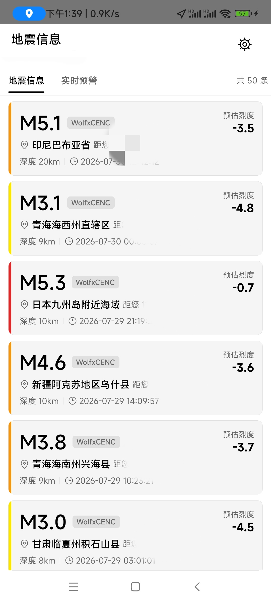
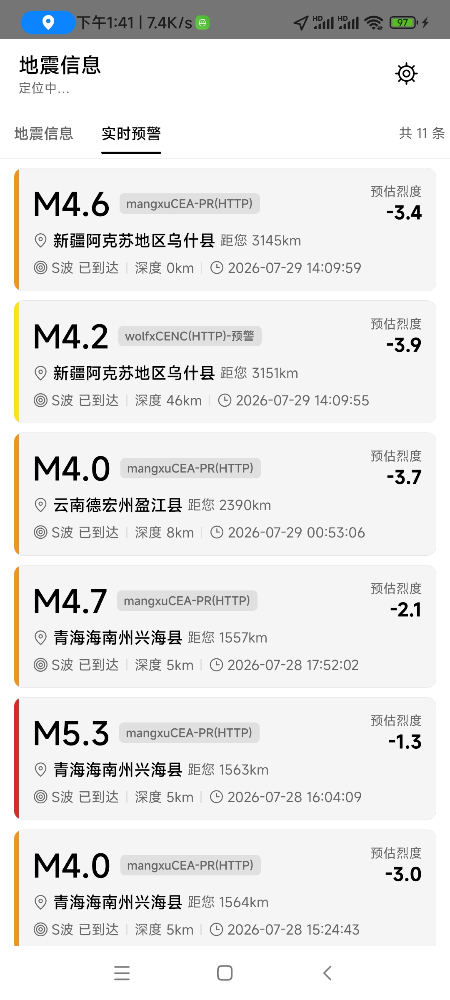
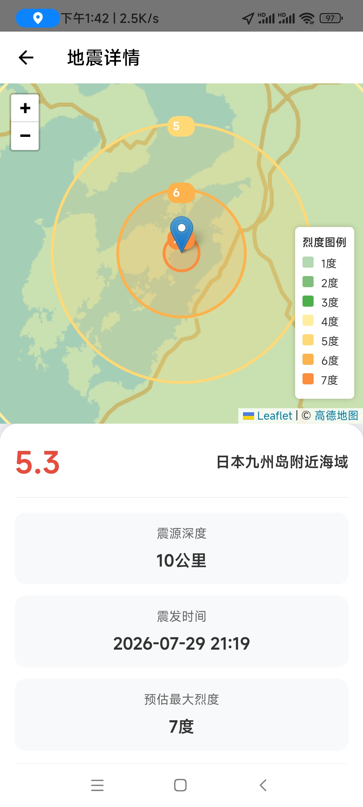

# 主界面实现（Task 5）

本文档说明地震预警 App 主界面的设计与实现。对应代码位于 `src/screens/`、`src/components/`、`src/hooks/`、`src/theme/`、`src/utils/` 与 `src/navigation/`。

## 1. 设计目标

- **黑白简约风格**：白底黑字（亮色）/ 黑底白字（暗色），仅预警级别竖条与状态图标使用彩色
- **SVG 线条图标**：所有图标使用 react-native-svg 绘制，不使用图片/emoji
- **亮暗模式**：通过 `useColorScheme` 自动适配系统色彩模式
- **真实数据驱动**：通过 `useEewStream` Hook 接入 `SourceManager` + `CustomSourceAdapter`，获取用户配置的自定义数据源预警事件流

## 2. 文件结构

```
src/
├── screens/
│   ├── HomeScreen.tsx          # 主界面：标题栏 + 状态栏 + Tab + 卡片列表
│   ├── EventDetailScreen.tsx   # 地震详情页（从卡片点击进入）
│   ├── SimulateAlertScreen.tsx # 模拟预警页（配置参数触发预警测试）
│   └── SettingsScreen.tsx      # 设置页
├── components/
│   ├── EewCard.tsx             # 实时预警卡（eew，含 S 波倒计时 + 机构标签）
│   ├── EqInfoCard.tsx          # 地震速报卡（eqlist，无倒计时 + 机构标签）
│   ├── SourceStatusBar.tsx     # 数据源状态栏
│   └── icons/
│       └── Icons.tsx           # SVG 线条图标集（8 个）
├── hooks/
│   ├── useEewStream.ts          # 预警事件流（多源并行模式）
│   ├── useConfig.ts             # 配置持久化
│   ├── useFloatingWindow.ts     # 悬浮窗联动
│   ├── useLockScreenAlert.ts    # 锁屏报警联动
│   ├── useAutoStart.ts          # 开机自启
│   ├── useOnboarding.ts         # 引导页
│   └── usePermissions.ts        # 权限管理
├── theme/
│   └── colors.ts               # 亮/暗色配色
├── utils/
│   ├── eew.ts                  # 预警计算辅助函数
│   └── sourceLabels.ts         # 数据源标签映射（机构简称 + 完整显示名）
└── navigation/
    └── types.ts                # 导航类型定义（含 EventDetail/SimulateAlert 路由）
```

## 3. 核心组件

### 3.1 HomeScreen（主界面）

布局结构（纯卡片列表，无地图）：

```
┌─────────────────────────────────┐
│ 地震预警                    [⚙]  │  标题栏（固定 48px）
├─────────────────────────────────┤
│ [地震信息] [实时预警]    共 N条  │  Tab 切换条（固定 44px）
├─────────────────────────────────┤
│ EewCard / EqInfoCard            │  FlatList（滚动）
│ ...                             │  卡片可点击 → EventDetail
│                                 │
└─────────────────────────────────┘
```

**地图移除说明**：

- 高德 Lite3dMap SDK 存在标注层与底图错位的 SDK 级渲染问题（平移/缩放时城市标注层与底图不同步），无法在应用层修复
- 原生地图模块（AMapViewManager/AMapViewPackage/CoordTransform + AAR）保留备用
- HomeScreen 改为纯卡片列表展示，默认显示"地震信息"（eqlist）Tab
- SourceStatusBar 已从首页移除（挡住设置按钮），数据源状态在设置页查看

**卡片点击导航**：

- 每张卡片用 `Pressable` 包裹，`onPress` 调用 `navigation.navigate('EventDetail', {event: item})`
- 详情页展示完整地震信息（震级、位置、时间、深度、机构、坐标、烈度、距离）

- 标题栏（地震信息 + 位置小字 + 设置按钮）固定在 SafeAreaView 顶部
  - 标题下方小字显示当前位置：定位中显示"定位中…"，定位成功显示坐标（如 `39.90°N, 116.40°E`），后续可接入高德逆地理编码显示城市名
- 使用 `useEewStream` 获取事件数据与数据源状态（多源并行模式）
- 使用 `useUserLocation` Hook 获取用户位置：
  - **GPS 模式**（默认）：`getCurrentPosition` + `watchPosition`，权限被拒/失败时降级为北京坐标（39.9°N, 116.4°E）
  - **手动模式**：用户在设置页输入经纬度，适合 GPS 不可用或想固定参考点的场景
  - 模式由 `AppConfig.location.mode` 控制（'gps' | 'manual'），手动坐标存于 `manualLat`/`manualLng`
- 设置按钮点击调用 `navigation.navigate('Settings')`
- 卡片列表区支持 Tab 切换：
  - **地震信息**（eqlist）：展示 `eewStream.eqlistEvents`，使用 `EqInfoCard`（无倒计时），默认选中
  - **实时预警**（eew）：展示 `eewStream.events`，使用 `EewCard`（含 S 波倒计时）
  - Tab 切换不持久化，默认进入"地震信息"

**主界面实际效果**：

**地震信息 Tab（速报卡列表）**：



**实时预警 Tab（预警卡列表，含 S 波倒计时）**：



### 3.2 EewCard（实时预警卡）

显示字段：

| 字段 | 说明 |
|------|------|
| 震级 | 大字号（28px），格式 `M5.2` |
| 机构标签 | 小字号 badge，如"中国地震台网"、"日本气象厅"（`getSourceAgency`） |
| 位置 | 震中地名 + 距用户距离 |
| S 波倒计时 | 从预估 S 波到达时间递减，到 0 显示"已到达" |
| 预估烈度 | 基于 CSIS 烈度预估算法（`calcCsis`，综合震级+震源深度+震中距离），显示**本地**预估烈度 |
| 震源深度 | 单位 km |
| 发震时间 | 格式 `YYYY-MM-DD HH:mm:ss` |

- 卡片左侧 4px 竖条颜色按**震中预估烈度**分档（距离=0 处的烈度，DB/T 113.1-2026 标准）
- 右侧"预估烈度"数值仍显示**本地**预估烈度（基于用户距离衰减）
- 倒计时每秒刷新（`setInterval` 1000ms）
- 黑白简约：白底黑字 / 黑底白字，仅竖条用彩色

预警级别与颜色映射：

| 级别 | 震级范围 | 亮色 | 暗色 |
|------|---------|------|------|
| silent | < 3.0 | `#9E9E9E` | `#9E9E9E` |
| info | 3.0~3.9 | `#2196F3` | `#64B5F6` |
| advisory | 4.0~4.9 | `#FFC107` | `#FFD54F` |
| warning | 5.0~5.9 | `#FF9800` | `#FFB74D` |
| critical | ≥ 6.0 | `#F44336` | `#EF5350` |

### 3.3 EqInfoCard（地震速报卡）

用于"地震信息"Tab（eqlist 数据源），展示已确定的地震速报信息。与 EewCard 的区别：**不含 S 波倒计时与每秒 tick 定时器**（速报为最终结果，无需倒计时）。

显示字段：

| 字段 | 说明 |
|------|------|
| 震级 | 大字号（28px），格式 `M5.2` |
| 机构标签 | 小字号 badge，如"中国地震台网"、"日本气象厅"（`getSourceAgency`） |
| 位置 | 震中地名 + 距用户距离 |
| 预估烈度 | 基于 CSIS 烈度预估算法（`calcCsis`），显示**本地**预估烈度 |
| 震源深度 | 单位 km |
| 发震时间 | 格式 `YYYY-MM-DD HH:mm:ss` |

- 卡片左侧 4px 竖条颜色按**震中预估烈度**分档（与 EewCard 共用 `computeAlertLevelByIntensity` 计算，距离=0 处的烈度）
- 右侧"预估烈度"数值仍显示**本地**预估烈度（基于用户距离衰减）
- 距离/烈度/级别用 `useMemo` 缓存，无定时器开销
- 黑白简约风格，与 EewCard 视觉一致

### 3.4 SourceStatusBar（数据源状态栏）

- 已从 HomeScreen 移除（挡住设置按钮）
- 组件保留，数据源状态在设置页查看

### 3.5 EventDetailScreen（地震详情页）

从首页卡片点击进入，展示完整地震信息和预估烈度分布。布局参考 `eqckq.html` 示例。

**地图实现**：使用 `react-native-webview` 加载 `assets/eqckq.html`（Leaflet + 高德瓦片 + 烈度圈），通过 URL 参数传入地震数据（`elat/elon/dph/m/name/time/theme`）。避开了原生 MapView 的标注层错位问题。

**布局结构**：

```
┌─────────────────────────────────┐
│ M6.7 [机构]         四川省泸定县 │  标题区：震级（红色）+ 机构标签 + 位置
├─────────────────────────────────┤
│                                 │
│        WebView 地图              │  Leaflet 地图 + 烈度圈（300px）
│    （震中标记 + 同心烈度圈）     │
│                                 │
├─────────────────────────────────┤
│ [震源深度] [震发时间]            │  详情网格（2列）
│ [预估最大烈度] [距您]            │
├─────────────────────────────────┤
│ 预估烈度分布范围                 │
│ ■ 8度: 15.2公里 ■ 7度: 32.1公里 │  烈度图例（彩色方块 + 距离）
│ ■ 6度: 58.3公里 ...             │
├─────────────────────────────────┤
│ 您所在位置的预估烈度             │  用户位置烈度（独立卡片）
│         3.2度                   │
├─────────────────────────────────┤
│ 安全提示                        │
│ (!) 保持冷静，迅速寻找坚固掩体   │  安全提示（黄色背景）
│ (!) 远离窗户、玻璃、吊灯...      │
│ (!) 地震停止后，迅速撤离...      │
│ (!) 不要使用电梯，选择楼梯逃生   │
├─────────────────────────────────┤
│ 最后更新: 2026-07-09 12:00      │  时间戳
└─────────────────────────────────┘
```

**实际效果**：



**烈度计算**（`src/utils/eew.ts`）：
- `calcCsis(m, dep, dis)` — CSIS 烈度预估（CEA + ICL 模型平均）
- `findDistanceForIntensity(m, dep, target)` — 二分查找特定烈度的影响半径
- `calculateIntensityRanges(m, dep)` — 计算 1-12 度各自的影响半径
- `INTENSITY_COLORS` — 12 级烈度颜色映射（绿→黄→橙→红→深红）
- 状态图标：connected(对勾-绿) / connecting(旋转箭头-黄) / disconnected(斜杠-灰) / error(三角形-红)
- `connecting` 状态下图标持续旋转（`Animated.loop`）
- 切换提示横幅（3 秒自动消失）
- 内置测试按钮：断开 / 重连 / 切换（用于测试不同状态下的 UI 表现）
- 元素间使用分隔符（1px 竖线）

### 3.6 SimulateAlertScreen（模拟预警页）

从设置页"模拟预警"入口进入，配置模拟地震参数并触发预警联动测试。替代已移除的测试数据源，用于无网络环境测试预警功能。

**布局结构**：

```
┌─────────────────────────────────┐
│ 说明区（功能简介）                │
├─────────────────────────────────┤
│ 震级        5.5 级               │  SliderRow（3.0-8.0，step 0.1）
│ 震源深度    15 km                │  SliderRow（5-50，step 1）
│ 震中距      100 km               │  SliderRow（0-1000，step 10）
│ 延时        5 秒                 │  SliderRow（0-60，step 1）
├─────────────────────────────────┤
│ [触发模拟预警（5秒后）]          │  触发按钮（三态：未触发/倒计时/已触发）
│                                 │  背景色按预估烈度分档：<4蓝/4-5黄/6-7橙/>=8橙红
├─────────────────────────────────┤
│ 预估效果                        │
│ 震级 5.5 级（警告）              │  预警级别 + 联动效果预览
│ 将触发悬浮窗 / 锁屏报警          │
└─────────────────────────────────┘
```

**触发逻辑**：

1. 根据震中距 + 随机方位角 + 用户位置（北京 39.9, 116.4）反算虚拟震中坐标（平面近似公式）
2. 构造 EewEvent（`source: 'simulated'`, `isFinal: false`）
3. 延时 > 0 时启动倒计时，倒计时期间滑块禁用（锁定参数），倒计时结束发射事件；延时 = 0 立即发射
4. 调用 `simulatedEventBus.emit(event)` 注入事件流
5. useEewStream 订阅事件总线，收到事件注入 `events` 列表
6. HomeScreen 的 `useFloatingWindow`/`useLockScreenAlert` 自动联动

**触发按钮烈度配色**：

- 复用 `calcCsis(magnitude, depth, distance)`（`src/utils/eew.ts`）计算预估烈度
- `intensityToColor(intensity)` 分档返回触发按钮背景色：
  - 烈度 < 4 → 蓝色 `#2196F3`
  - 烈度 4-5.9 → 黄色 `#FFC107`
  - 烈度 6-7.9 → 橙色 `#FF9800`
  - 烈度 >= 8 → 橙红色 `#FF5722`
- 拖动滑块时按钮颜色实时变化，直观反映当前参数下的预估烈度

**事件注入机制**：

- `simulatedEventBus`（`src/utils/simulatedEventBus.ts`）为模块级单例发布订阅
- useEewStream 是 Hook，各页面独立实例 state 不共享，通过单例总线跨页面注入
- 模拟事件 `isFinal=false`，走正常 eew 超时清理（5 分钟后自动移除）

**参数不持久化**：每次进入页面重置为默认值（震级 5.5 / 深度 15km / 震中距 100km / 延时 5秒），符合"不回填"偏好。

### 3.5 Icons（SVG 图标集）

8 个 SVG 线条图标，均为 24×24，stroke 当前颜色，fill none，strokeWidth 1.5：

| 图标 | 用途 |
|------|------|
| `SettingsIcon` | 齿轮 — 设置按钮 |
| `ConnectionIcon` | 对勾 — 已连接状态 |
| `ConnectingIcon` | 旋转箭头 — 连接中状态 |
| `DisconnectedIcon` | 斜杠 — 已断开状态 |
| `ErrorIcon` | 三角形感叹号 — 错误状态 |
| `LocationIcon` | 地图针 — 位置标识 |
| `ClockIcon` | 时钟 — 时间标识 |
| `WaveIcon` | 同心圆 — S 波标识 |

## 4. 预警事件流（useEewStream）

封装多数据源并行获取、事件合并与状态管理，供 HomeScreen 消费。对应代码 `src/hooks/useEewStream.ts`。

### 4.1 多源并行架构

与之前的主备切换模式不同，现已改为**多源并行模式**：

- 每个启用的数据源创建独立 SourceManager（单源模式，无备用队列）
- 所有源的事件合并到同一列表（eew / eqlist 各一个），按 `originTime` 降序排序
- 跨源去重：同一地震可能被多个机构报告，以 `originTime+坐标+震级` 组合键去重（坐标四舍五入到 0.01 度约 1km 容差）
- 全局状态：任一源 connected 则全局 connected，全部 error/disconnected 则全局 error

### 4.2 接口

```typescript
interface UseEewStreamResult {
  events: EewEvent[];           // 预警事件列表（最新在前，最多 20 条）
  eqlistEvents: EewEvent[];     // 速报事件列表（最新在前，最多 50 条）
  sourceStatus: SourceStatus;   // 全局连接状态
  activeSource: string;         // 主源显示名（优先级最高的启用源）
  sourceName: string;           // 同 activeSource
  backupCount: number;          // 启用源总数 - 1
  switchMessage: string | null; // 切换提示（3 秒后自动清除）
  disconnect: () => void;       // 断开所有源
  reconnect: () => void;        // 重连所有源
  switchToBackup: () => void;   // 多源并行模式下为空操作（保留接口兼容）
}
```

### 4.3 事件列表上限

| 类别 | 上限 | 原因 |
|------|------|------|
| eew（预警） | 20 条 | 预警事件活跃期短，20 条足够 |
| eqlist（速报） | 50 条 | 保留全部历史速报（与典型 eqlist API 返回条数一致） |

### 4.4 事件清理

- eew 的 `isFinal=true`（取消报/终止报）立即从 `events` 移除
- eqlist 的 `isFinal=true` 表示"正式测定"而非"事件终止"，**不移除**
- 超过 5 分钟无更新的事件自动移除（每 30 秒检查，eew + eqlist 同步清理）

### 4.5 机构标签

`src/utils/sourceLabels.ts` 提供两个映射函数：

- `getSourceName(source)` — 完整显示名（如"自定义数据源"/"模拟预警"），用于 SourceStatusBar
- `getSourceAgency(source)` — 机构简称（如"自定义"/"模拟"），用于卡片机构标签

合规改造（v13+）后，`SourceType` 仅保留 `customSource` 和 `simulated` 两个标识，显示名由 `SOURCE_NAMES` 映射决定。

## 5. 配色系统（colors.ts）

- `lightColors` / `darkColors` 字段完全一致，通过 `getColors(isDark)` 切换
- 主色调：黑/白/灰阶（background / surface / text / textSecondary / border）
- 彩色仅用于预警级别（silent / info / advisory / warning / critical）
- 暗色模式下预警级别颜色略调亮以保证可读性

## 6. 预警计算辅助（utils/eew.ts）

| 函数 | 说明 |
|------|------|
| `haversineDistance(lat1, lng1, lat2, lng2)` | Haversine 公式计算球面距离（km） |
| `computeAlertLevel(magnitude)` | 根据震级计算预警级别 |
| `computeIntensity(magnitude, distanceKm)` | ⚠️ 已废弃（@deprecated），简化烈度衰减估算（对数衰减）。请改用 `calcCsis` |
| `calcCsis(m, dep, dis)` | CSIS 烈度预估算法，综合 CEA 与 ICL 两种模型取平均（考虑震源深度） |
| `computeSWaveArrival(event, userLat, userLng)` | 计算 S 波到达时间戳（S 波速度 3.5 km/s） |
| `formatOriginTime(timestamp)` | 格式化发震时间 |

## 7. 导航（App.tsx）

- 使用 `@react-navigation/native-stack` 的 `createNativeStackNavigator`
- 五个页面：`Onboarding`（引导页）+ `Home`（主界面，无导航栏）+ `Settings`（设置页，带返回按钮）+ `EventDetail`（地震详情页）+ `SimulateAlert`（模拟预警页）
- `GestureHandlerRootView` 包裹根组件（导航栈手势依赖）
- `SafeAreaProvider` 提供安全区域上下文
- 导航主题跟随系统色彩模式

### 安装的依赖

```
@react-navigation/native@7.3.7
@react-navigation/native-stack@7.17.9
react-native-screens@4.25.2
react-native-gesture-handler@3.0.2
react-native-svg@15.15.5
```

## 8. 关键设计决策

1. **用户位置获取**：使用 `useUserLocation` Hook（`src/hooks/useUserLocation.ts`）通过 `@react-native-community/geolocation` 获取真实 GPS 位置。挂载时 `getCurrentPosition` 快速拿一次（15s 超时），成功后 `watchPosition` 持续更新（60s 间隔 / 100m 位移阈值，省电）。权限被拒/定位失败/超时时降级为北京坐标（39.9, 116.4）并标记 `isMock=true`，保证距离与 S 波倒计时始终有可用坐标，App 不崩。位置权限在 Onboarding 引导页已请求（`ACCESS_FINE_LOCATION`），本 Hook 不重复请求。

2. **标记实现方式**：震中标记使用 View + Animated.View 而非 SVG，因 react-native-maps 的 Marker 在 Android 上将子组件渲染为位图，View 方式更可靠。红色圆点 + 波纹满足"自定义 SVG"的设计意图。

3. **状态图标着色**：SourceStatusBar 的状态图标使用彩色（绿/黄/灰/红）以快速区分状态，其余 UI 严格黑白。这与"仅预警级别竖条用彩色"的规则不冲突——状态栏图标需要颜色编码以保证可用性。

4. **测试按钮**：SourceStatusBar 内置断开/重连/切换按钮，便于测试不同状态下的 UI 表现。按钮有足够间距（hitSlop 8px）避免误触。

5. **倒计时格式**：超过 60s 显示 `Xm Ys`，否则 `Xs`；到达后显示"已到达"。

## 9. 类型检查

在 `android-eew-app/` 目录下执行：

```sh
npx tsc --noEmit
```

应无任何错误输出（exit code 0）。

## 10. 与后续任务的衔接

| 任务 | 衔接点 |
|------|--------|
| Task 6（✅ 已完成） | `useEewStream` 封装 `SourceManager`，HomeScreen 已接入 `CustomSourceAdapter`（用户配置的自定义数据源）。原 `useMockEewStream` 已删除 |
| Task 4（后台服务） | 后台服务推送事件 → HomeScreen 订阅 → 更新卡片列表 |
| Task 7+ | 烈度衰减精化、报警触发、悬浮窗等 |
| 后续 | 接入真实 GPS 定位，替换 `MOCK_USER_LAT` / `MOCK_USER_LNG` 常量（已通过 `useUserLocation` Hook 完成） |
